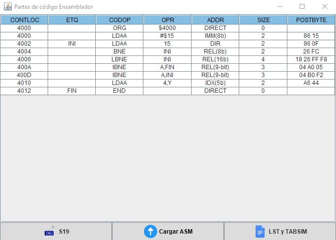
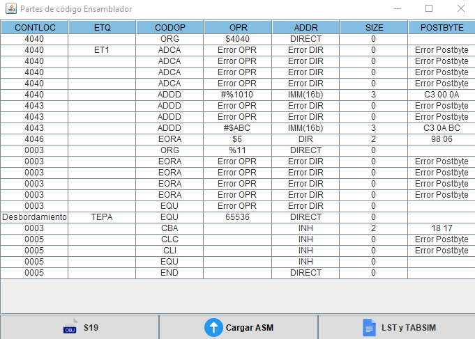

# HC12

El ensamblador HC12 es un lenguaje de programación de bajo nivel específico para los microcontroladores de la familia HC12 (también conocida como HCS12) de Freescale Semiconductor, que anteriormente formaba parte de Motorola. Estos microcontroladores son utilizados en una amplia gama de aplicaciones embebidas debido a su capacidad y versatilidad. Este proyecto implementa un ensamblador para el procesador HC12, diseñado en Java, que realiza las operaciones esenciales para interpretar y ejecutar instrucciones en este microcontrolador. Es ideal para quienes desean comprender mejor el funcionamiento del ensamblador y cómo interactúa con las instrucciones de bajo nivel.
   

   

## Objetivo:
El proyecto tiene fines educativos y busca ayudar a entender los principios de un ensamblador, las operaciones del procesador HC12, y la gestión de sus instrucciones en bajo nivel.
   

## Funcionalidades principales:
Lectura de archivos de entrada:

1. Soporte para archivos con código fuente en formato ensamblador (ASM).
2. Identificación de etiquetas, códigos operando, tamaño y modo de direccionamiento.
3. Cálculo del postbyte:
   

## Descripción de Prefijos para los sistemas númericos
| **Binario** | **Octal** | **Hexadecimal** | **Decimal** |
| ----- | ------------- | ------------ | --- | 
| % | @ | $ | No tiene símbolo |  

   

## Determinación del postbyte según las instrucciones específicas del HC12.
| **Elemento**                  | **Abreviatura** | **Descripción** |
|-------------------------------|-----------------|---------------------------------------------------------------------------------|
| **Contador de programa**      | CONTLOC         | Mantiene la sumatoria de acuerdo a las instrucciones proporcionadas.            |
| **Etiqueta**                  | ETQ             | Etiquetas encontradas en el archivo ASM.                                        |
| **Código Operando**           | OPR             | Número decimal, binario, octal o hexadecimal.                                  |
| **Modo de direccionamiento**  | ADDR               | Especifica cómo se obtiene la dirección o el operando para una instrucción. En el HC12, existen diferentes tipos de modos de direccionamiento que determinan cómo se accede a los datos. |
| **Tamaño**                    | SIZE            | Cantidad de bytes que ocupa una instrucción en memoria.                         |
| **Postbyte**                  | POSTBYTE        | Define la longitud de la instrucción en hexadecimal.                           |

   

## Tipos de modos de direccionamiento 
| **Modo de Direccionamiento**        | **Abreviatura** | **Descripción**                                                                                                                                   | **Ejemplo**                          |
|-------------------------------------|-----------------|---------------------------------------------------------------------------------------------------------------------------------------------------|--------------------------------------|
| **Inherente**                       | INH             | No tiene operando.                                                                                                                                | NOP, INX                             |
| **Inmediato**                       | IMM             | El operando inicia con `#` y puede ser de 8 o 16 bits (decimal, binario, octal, hexadecimal).                                                      | LDAA #55, LDX #$0234, LDAA #%11      |
| **Directo**                         | DIR             | El operando es una dirección directa de 8 bits.                                                                                                    | LDAA $55, LDAA $0055, LDX $20        |
| **Extendido**                       | EXT             | El operando es una dirección de 16 bits o un valor entre 256 y 65535.                                                                              | LDAA 300, LDAA $FFFF, LDX VALOR1     |
| **Indexado 5 bits**                 | IDX             | Rango de -16 a 15, seguido de una coma y un registro válido (X, Y, SP, PC).                                                                      | LDAA ,X, LDAA 1,SP, LDAA -16,X       |
| **Indexado 9 bits**                 | IDX1            | Rango de -256 a -17 y de 16 a 255, seguido de coma y un registro válido (X, Y, SP, PC).                                                           | LDAA 255,X, LDAA -256,X              |
| **Indexado 16 bits**                | IDX2            | Rango de 256 a 65535, seguido de coma y un registro válido (X, Y, SP, PC).                                                                        | LDAA 31483,X                         |
| **Indexado Indirecto 16 bits**      | [IDX2]          | Rango de 0 a 65535, seguido de coma y un registro válido, con corchetes.                                                                          | LDAA [10,X], LDAA [31483,X]          |
| **Indexado con Decremento/Incremento** | IDX            | El operando tiene un valor de 1 a 8, seguido de coma y un signo positivo o negativo, con un registro válido (X, Y, SP).                          | STAA 1,-SP, STAA 1,SP-, STX 2,SP+    |
| **Indexado Acumulador**             | IDX             | Utiliza registros A, B, D antes de la coma y un registro válido (X, Y, SP, PC) después de la coma.                                                 | LDAA B,X, STX b,PC                   |
| **Indexado Acumulador Indirecto**   | [D,IDX]         | Solo el registro `D` antes de la coma y un registro válido (X, Y, SP, PC) después, con corchetes.                                                  | JMP [D,PC], ADCA [D,X]              |
| **Relativo**                        | REL             | El operando es una etiqueta que cumple las reglas de escritura de etiquetas, y la instrucción puede ser de 8 o 16 bits.                           | LBRA DOS_2, BRA Tres                |
| **Relativo con Ciclo**              | REL             | El operando incluye un registro (A, B, D, X, Y, SP) seguido de una etiqueta.                                                                      | IBNE A, Tres                         |

   

## Detección de errores de sintaxis en el código ensamblador.
Manejo de instrucciones y operandos no válidos.
1. En caso de que exista un error el programa encontrará y marcara el error:
   
| **Contador de programa** | **Operando** |  **ADDR** |  **Postbyte** |
| ------------ | ------------ | ------------ | ------------ | 
| Desbordamiento | Error OPR | Error DIR | Error Postbyte |
| Número imposible de calcular | #$FFt | Código operando erróneo | Número imposible de calcular | 

### ¿A qué se refiere "Número imposible calcular"?
1. El número proporcionado en cualquiera de las 4 sistemas númericos esta mal proporcionado
- Debido a que el prefijo está mal
- No es un numero entre 64 kylobytes (número decimal mayor o igual a 65536)
- Existen caractéres inválidos dentro del operando
- No es un número válido de acuerdo con su sistema decimal

### Ejemplo de números imposibles de calcular
| **Operando**    | **Descripción**                                                                                                 |
|-----------------|-----------------------------------------------------------------------------------------------------------------|
| `#$FFt`          | `"t"` no es parte de los hexadecimales. El operando está en formato hexadecimal, pero "t" no es un valor válido. |
| `#ABC`           | El número está en sistema hexadecimal y no tiene su prefijo (se debe representar como `$ABC`).                 |
| `#FFFF`          | El número es mayor a 65536 en sistema decimal, lo que causa un desbordamiento de memoria.                        |

   

## Requisitos del sistema:
1. Java Development Kit (JDK): versión 8 o superior.
2. Un editor de texto o IDE (como IntelliJ IDEA o Eclipse) para ejecutar el proyecto.
3. Archivos ASM
4. Es posible descargar la carpeta de "Ejecutables" y "ASM". Los ejecutables son archivos .JAR que se podrán ejecutar de manera directa sin utilizar una IDE, el uso de este programa requiere de archivos ASM, mismos que se proporcionan en el repositorio, la carpeta "ASM" cuenta con varios archivos para probar el programa, con diferentes modos de direccionamiento, incluso con errores, para hacer uso se recomienda leer los manueles y ver los ejemplos proporcionados
   
### Cómo usar:
1. Clona este repositorio en tu máquina local.
2. Carga el proyecto en tu IDE favorito.
3. Compila y ejecuta la clase principal, el programa terminado se encuentra disponible dentro de la carpeta "Parte 5". También es posible utilizar los archivos .JAR para ejecutar de manera directa.  
4. Proporciona un archivo ensamblador válido para procesar las instrucciones del HC12 (en la carpeta ASM se proporcionan un conjunto de archivos para probar).
